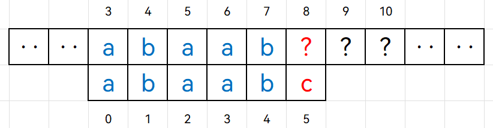
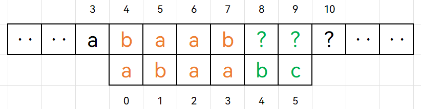
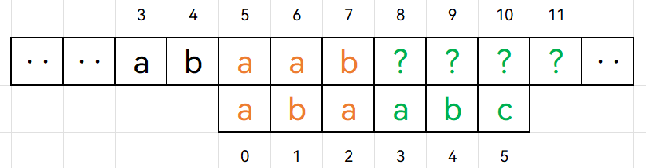
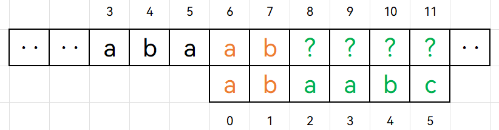

+++
title = 'KMP算法'
date = 2024-03-29T19:39:32+08:00

+++

KMP算法是著名的字符串匹配算法。所谓字符串匹配，其实就是子串（常称为模式串）的定位操作，它求的是模式串在主串中的位置。

## 对朴素模式匹配算法的改进

对于字符串匹配问题，我们很容易想到暴力解法（即朴素模式匹配算法）：枚举主串中的每一个位置，考虑以其作为起点，与模式串中对应位置的元素进行匹配。一旦在某个位置匹配不上（失配），就考虑以下一个位置为起点，重新与模式串进行匹配，如此反复进行。

很显然，朴素模式匹配算法的时间复杂度为$O(n×m)$。

```cpp
int strStr(string haystack, string needle) {
    for (int i = 0; i + needle.size() <= haystack.size(); ++i) {
        bool flag = true;
        for (int j = 0; j < needle.size(); ++j) {
            if (haystack[i + j] != needle[j]) {
                flag = false;
                break;
            }
        }
        if (flag)
            return i;
    }
    return -1;
}
```

朴素模式匹配算法的思想真的很朴素——不管在什么位置，只要发生失配，都选择以主串起点的下一个位置作为新起点，与模式串从头开始匹配。但这真的有必要吗？换句话说，发生失配时，我们真的需要以下一个位置为起点从头再来吗？是否有更好的选择呢？肯定是有的，下面我们来分析一下。

以下图为例，当我们在模式串下标为`5`的位置发生失配时，主串中对应于子串前面的部分（即主串下标为`3`到`7`的部分）的内容，我们是知道的。因为这些位置跟与模式串是匹配的。



按照暴力解法，接下来的一轮匹配操作将如下图所示。我们可以把这一轮匹配操作分为两个部分：首先是与主串中已知部分的匹配（橙色部分），然后是与主串中未知部分匹配（绿色部分）。对于橙色部分，实际上就相当于拿着模式串中`0`到`4`子串(`"abaab"`)的长度为4的前缀(`"abaa"`)和长度为4的后缀(`"baab"`)进行匹配。但这个结果我们是可以事先计算好的，因为它只与模式串相关，而且模式串本身较短，计算量并不大。如果我们事先已经知道`"abaab"`长度为4的前后缀不相等，我们就完全没必要考虑以主串位置`4`为起点。



同理，以主串位置`5`为起点也是没有必要的，因为`"abaab"`长度为3的前后缀并不相等。



但以主串位置`6`为起点是有必要的，因为`"abaab"`长度为2的前后缀是相等的，都是`"ab"`。此时，我们应该从子串下标为`2`的位置开始匹配，如下图所示：



从上述例子中，我们可以归纳出如下解决方案，它适用于在模式串各个位置发生失配的情况：

当在模式串下标为`j`的位置与主串位置`i`发生失配时，指针`j`可以直接跳转到某一下标重新与主串的当前位置`i`进行比较，这个下标等于模式串中`0`到`j - 1`子串的最长相等前后缀长度。如下图所示：


因此，我们只需要事先计算出模式串中`0`到`j - 1`子串的最长相等前后缀长度，就能省去朴素模式匹配算法中许多不必要的比较操作。这就是KMP算法的核心思想。

## KMP算法核心思想

KMP算法的核心思想可总结为如下两点：

- 计算`next`数组，`next[j]`表示模式串中`0 - j`子串的最长相等前后缀长度
- 在模式串下标为`j`的位置与主串发生失配时，跳转到`next[j - 1]`的位置重新与主串的当前位置进行比较

通过这一思路，可以实现主串指针不回溯，算法时间复杂度为$O(n+m)$。

## KMP算法代码实现

```cpp
vector<int> BuildNext(const string& patt) {
    vector<int> next(patt.size(), 0);
    int prefix_len = 0;		// 当前的共同前后缀长度
    int i = 1;
    while (i < patt.size()) {
        if (patt[i] == patt[prefix_len])
            next[i++] = ++prefix_len;
        else if (prefix_len == 0)
            next[i++] = 0;
        else 
            prefix_len = next[prefix_len - 1];
    }
    return next;
}

int KMP(string haystack, string needle) {
    auto next = BuildNext(needle);
    int i = 0;  // 主串指针
    int j = 0;  // 子串指针
    while (i < haystack.size()) {
        if (haystack[i] == needle[j]) {		// 字符匹配，指针后移
            ++i;
            ++j;
        } else if (j > 0)		// 失配，根据next修改子串指针j
            j = next[j - 1];
        else 								// 子串第一个字符就错了
            ++i;
        if (j == needle.size())		// 匹配成功
            return i - j;
    }
    return -1;
}
```

## 结语

实际上，KMP算法最难的地方就是`next`数组的计算。然而我并没有对这方面进行讲解，主要是因为最近太忙了，写博客是一件比较花时间的事情，等后面有空了再来把这部分内容补上吧。
