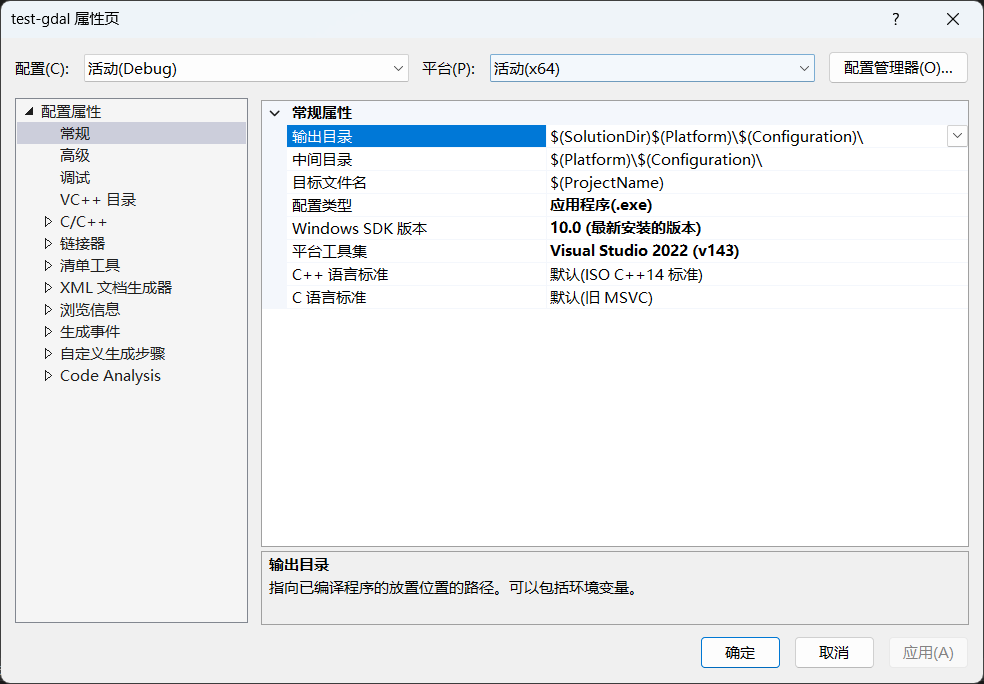

## 前言

在开发中，我们经常会使用到第三方库，以避免造轮子，从而提高开发效率。在C++中，要使用第三方库，首先需要进行以下步骤：

1. 获取库文件和头文件
2. 告知编译器头文件的所在目录
3. 告知编译器库文件的所在目录
4. 告知编译器要链接的库文件

对于某些第三方开源库，官方并没有提供编译好的库文件，此时就需要自己动手编译，得到适合于自己平台下的库文件。

出于毕业要求的需要，笔者前段时间写了一个软著，其中某些功能的实现需要用到gdal。而gdal就属于上述所说的“需要自己动手编译”的开源库，当然你也可以去寻找别人已经编译好的库文件。

搭建使用第三方库的C++开发环境的核心原理是固定的，也就是上述提到的4个步骤，但具体操作因平台而异。以下将对“Windows下的gdal开发环境搭建过程”做一个记录，以供自己学习之用，也希望能够帮到有需要的人。

## 基于vcpkg的gdal库编译

[vcpkg](https://learn.microsoft.com/zh-cn/vcpkg/get_started/overview)是微软推出的开源的C/C++库管理器，它能够自动为我们处理库编译所需的各种依赖关系，就像是Python中的miniconda。

- 下载vcpkg

  使用git-bash中执行以下命令，以下载vcpkg。

  ```bash
  git clone https://github.com/microsoft/vcpkg.git
  ```

  

  如果你没有git，打开上述命令中的网址，点击"Code"-"Download ZIP"，下载后解压即可。

  

- 使用vcpkg进行gdal库编译

  在vcpkg文件夹的上级目录中，使用命令提示符(cmd)依次执行以下命令。

  ```shell
  .\vcpkg\bootstrap-vcpkg.bat
  .\vcpkg\vcpkg install gdal:x64-windows
  ```

  接下来，可以喝杯茶、摸会儿鱼，等待编译完成。编译耗时因电脑性能而异，在笔者的电脑中，耗时42分钟。

  

- 查看库文件和头文件

  进入`vcpkg/installed/x64-windows`

  - bin和lib文件夹中分别存放着适用于Relese模式下的动态库文件(.dll)和静态库文件(.lib)
  - debug中的bin和lib文件夹分别存放着适用于Debug模式下的动态库文件(.dll)和静态库文件(.lib)
  - include文件夹中存放着头文件

  

以上就是基于vcpkg进行gdal库编译的操作过程，本文没有对相关命令进行讲解，更多详细信息请参考[vcpkg的GitHub仓库](https://github.com/microsoft/vcpkg)。

## Visual Studio项目属性设置

打开Visual Studio，创建一个C++空项目，在项目中添加一个.cpp文件。随后，在项目右键菜单中点击“属性”，将弹出如下图所示的“[项目名]属性页”。



在设置项目属性之前，我们可以先将库文件和头文件放到项目文件夹中，这样在后续的项目设置中，就可以尽量使用相对路径。这样做的好处是，当我们将整个项目打包，放到其他电脑中打开时，就不用修改项目属性了。

1. 在解决方案目录下新建名为"gdal"的文件夹

   

2. 将`vcpkg/installed/x64-windows`下的"bin"、"debug"、"include"、"lib"文件夹拷贝至刚刚新建的"gdal"文件夹中

   

接下来我们正式开始进行项目属性设置（以Debug配置为例）

- 设置附加包含目录 - 告知编译器头文件的所在目录

  在"C/C++"-"常规"-"附加包含目录"中填写`$(SolutionDir)gdal\include`

  

- 设置附加库目录 - 告知编译器.lib库文件的所在目录

  在"链接器"-"常规"-"附加库目录"中填写`$(SolutionDir)gdal\debug\lib`

  

- 设置环境 - 告知编译器.dll库文件的所在目录

  在"调试"-"环境"中填写`Path = $(SolutionDir)gdal\debug\bin`

  

- 设置附加依赖项 - 告知编译器要链接的库文件

  在"链接器"-"输入"-"附加依赖项"中填写`gdald.lib`

  

最后点击确定，项目属性设置完毕。

## 测试

在main.cpp文件中输入如下代码，注意要将第7行的文件路径改成你自己的，第13行的函数实参也要做相应的修改。

```cpp
#include "ogrsf_frmts.h"
#include <iostream>
using namespace std;
int main() {
    GDALAllRegister();		// 自动注册所有驱动，只能读不能写
    GDALDataset* poDS = static_cast<GDALDataset*>(GDALOpenEx(
        "./data/point.shp", GDAL_OF_VECTOR, nullptr, nullptr, nullptr));	// 创建Dataset
    if (poDS == nullptr) {
        cout << "open failed." << endl;
        exit(1);
    }

    OGRLayer* poLayer = poDS->GetLayerByName("point");		// 获取Layer，shapefile格式的LayerName就是文件名
    OGRFeatureDefn* poFDefn = poLayer->GetLayerDefn();		// 获取Layer的定义（包含Geometry和Field的定义）

    poLayer->ResetReading();		// 重置游标
    OGRFeature* poFeature;
    while ((poFeature = poLayer->GetNextFeature()) != nullptr) {		// 输出Layer中所有Feature的字段值
        for (int iField = 0; iField < poFDefn->GetFieldCount(); ++iField) {
            OGRFieldDefn* poFieldDefn = poFDefn->GetFieldDefn(iField);
            switch (poFieldDefn->GetType()) {
                case OFTInteger:
                    printf("%d,", poFeature->GetFieldAsInteger(iField));
                    break;
                case OFTInteger64:
                    printf(CPL_FRMT_GIB ",",
                           poFeature->GetFieldAsInteger64(iField));
                    break;
                case OFTReal:
                    printf("%.3f,", poFeature->GetFieldAsDouble(iField));
                    break;
                case OFTString:
                    printf("%s,", poFeature->GetFieldAsString(iField));
                    break;
                default:
                    printf("%s,", poFeature->GetFieldAsString(iField));
                    break;
            }
        }
        cout << endl;
        OGRFeature::DestroyFeature(poFeature);		// GetNextFeature()返回的似乎是一个对象的拷贝，因此需要自行销毁
    }
    return 0;
}
```

点击“开始调试”，不出意外的话，程序可以正常运行。

但是，控制台首行会提示"Cannot find proj.db"，所谓的"proj.db"实际存放在`vcpkg\installed\x64-windows\share\proj`中，我们可以使用以下两种方式让程序找到它。

1. 利用名为"PROJ_LIB"的环境变量，指明"proj.db"所在目录
2. 将"proj.db"拷贝到项目目录以及可执行文件所在目录

（完）