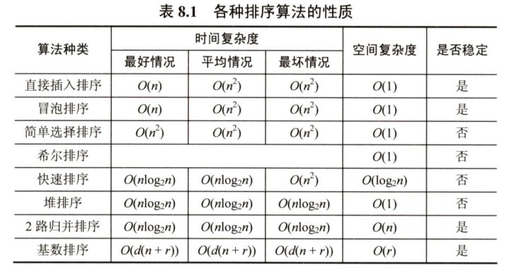

+++
title = '常见的内部排序算法总结'
date = 2024-02-26T16:32:19+08:00
+++

内部排序算法是面试中的常考点，其中快速排序和归并排序是重点。

以下是我对常见的内部排序算法的简单总结，仅供自己复习之用，不涉及详细的算法讲解。

## 插入排序

插入排序是一种简单直观的排序方法，其基本思想是每次将一个待排序的元素按其关键字大小插入到前面已排好序的子表中，直到全部元素插入完成。

由插入排序的思想可以引申出三个重要的排序算法：直接插入排序、折半插入排序、希尔排序。

### 直接插入排序

- 算法思想

  初始时将第一个元素视为已排好序的子表，然后依次将后面的元素插入到已排好序的子表中。

- 算法实现

  ```cpp
  void StraightInsertionSort(vector<int>& nums) {
      // 将各元素插入到前面排好序的子表中
      for (int i = 1; i < nums.size(); ++i) {
          int temp = nums[i];
          int j;
          // 前面排好序的子表中比待插入元素大的都要向后挪一个位置
          for (j = i - 1; j >= 0 && nums[j] > temp; --j)
              nums[j + 1] = nums[j];
          // 将待插入元素复制到插入位置
          nums[j + 1] = temp;
      }
  }
  ```

- 算法分析

  - 空间复杂度$O(1)$
  - 时间复杂度$O(n^2)$
  - 稳定性：稳定

### 折半插入排序

- 算法思想

  当排序表是顺序表时，可以对直接插入排序算法做如下改进：使用折半查找来确定待插入位置，然后再统一地向后移动元素。

- 算法实现

  ```cpp
  void BinaryInsertionSort(vector<int>& nums) {
      for (int i = 1; i < nums.size(); ++i) {
          int temp = nums[i];
          // 二分查找插入位置
          int left = 0;
          int right = i - 1;
          while (left <= right) {
              int mid = left + (right - left) / 2;
              if (temp < nums[mid])
                  right = mid - 1;
              else
                  left = mid + 1;
          }
          // 从插入位置开始往后的元素都要向后挪一个位置
          for (int j = i - 1; j >= left; --j)
              nums[j + 1] = nums[j];
          // 将待插入元素复制到插入位置
          nums[left] = temp;
      }
  }
  ```

- 算法分析

  - 空间复杂度$O(1)$
  - 时间复杂度$O(n^2)$：仅减少了比较元素的次数，而移动元素的次数并未改变
  - 稳定性：稳定

### 希尔排序

- 算法思想

  直接插入排序算法的时间复杂度为$O(n^2)$，但若待排表为“正序”时，其时间复杂度可提高至$O(n)$，由此可见它更适用于基本有序的排序表和数据量不大的排序表。希尔排序正是基于这两点分析对直接插入排序进行改进而得来的，又称缩小增量排序。

  希尔排序的基本思想是：先将待排序表分割成若干形如`{i, i+d, i+2d, ..., i+kd}`的“子表”，即把相隔某个“增量”的元素组成一个子表，对各个子表分别进行直接插入排序。逐步减少增量`d`，使排序表逐步呈现“基本有序”的情形，最终`d = 1`，即对全体元素进行一次直接插入排序。

- 算法实现

  ```cpp
  void ShellSort(vector<int>& nums) {
      for (int d = nums.size() / 2; d >= 1; d /= 2) {  // 步长变化
          // 从子表的第二个元素开始，进行直接插入排序
          for (int i = d; i < nums.size(); ++i) {
              int temp = nums[i];
              int j;
              for (j = i - d; j >= 0 && nums[j] > temp; j -= d)
                  nums[j + d] = nums[j];
              nums[j + d] = temp;
          }
      }
  }
  ```

- 算法分析

  - 空间复杂度$O(1)$
  - 时间复杂度：比直接插入排序要低，具体多少未知，这是数学上尚未解决的难题
  - 稳定性：不稳定，当相同的元素被划分到不同的子表时，可能会改变它们之间的相对次序

## 交换排序

### 冒泡排序

- 算法思想

  从后往前（或从前往后）两两比较相邻元素值，若为逆序，则交换它们。我们称这是一趟冒泡，每趟冒泡的结果会将最小的元素交换到待排序表的第一个位置。下一趟冒泡时，前一趟确定的最小元素（或最大元素）不再参与比较。这样最多做`n-1`趟就能完成排序。

- 算法实现

  ```cpp
  void BubbleSort(vector<int>& nums) {
      for (int i = 0; i < nums.size() - 1; ++i) {
          bool swaped = false;  // 记录本趟冒泡是否发生过交换
          for (int j = nums.size() - 1; j > i; --j) {
              if (nums[j - 1] > nums[j]) {
                  swap(nums[j - 1], nums[j]);
                  swaped = true;
              }
          }
          if (swaped == false)  // 没有发生过交换，说明已经有序
              return;
      }
  }
  ```

- 算法分析

  - 空间复杂度$O(1)$
  - 时间复杂度$O(n^2)$
  - 稳定性：稳定，相邻元素相等时，不会发生交换

### 快速排序

- 算法思想

  在待排序表`{1...n}`中任取一个元素作为枢轴`pivot`，通过一趟排序将待排序表划分为独立的两部分`{1...k-1}`和`{k+1...n}`，使得`{1...k-1}`中的所有元素小于枢轴`pivot`，`{k+1...n}`中所有元素大于等于枢轴`pivot`，则枢轴`pivot`放在了其最终位置`k`上，这个过程称为一趟快速排序（或一次划分）。然后分别递归地对两个子表重复上述过程，直至子表内只有一个元素或为空为止，即所有元素都放在了其最终位置上。

- 算法实现

  ```cpp
  void QuickSort(vector<int>& nums, int left, int right) {
      if (left >= right)
  				return;
      int pivot_index = Partition(nums, left, right);  // 划分
      // 分别对两个子表进行递归排序
      QuickSort(nums, left, pivot_index - 1);
      QuickSort(nums, pivot_index + 1, right);
  }
  
  int Partition(vector<int>& nums, int left, int right) {
      int pivot = nums[left];  // 将第一个元素作为枢轴
      while (left < right) {    // 循环跳出条件
          // 将小于枢轴的元素移动到左边
          while (left < right && nums[right] >= pivot)
              --right;
          nums[left] = nums[right];
          // 将大于等于枢轴的元素移动到右边
          while (left < right && nums[left] < pivot)
              ++left;
          nums[right] = nums[left];
      }
      nums[left] = pivot;  // 将枢轴元素放到最终位置
      return left;
  }
  ```

- 算法分析

  - 空间复杂度$O(log_2n)$：快速排序的递归调用过程可以看成是一棵结点数为`n`的二叉树，空间复杂度取决于树的深度，平均空间复杂度与最好空间复杂度接近
  - 时间复杂度$O(nlog_2n)$：在树的每一层中的时间复杂度不超过$O(n)$，时间复杂度为$O(n×树的深度)$
  - 稳定性：不稳定

## 选择排序

选择排序的基本思想是每次从待排序表中选出最小（或最大）的元素，加入到有序子表中。

### 简单选择排序

- 算法思想

  通过遍历的方式，从待排序表中最小（或最大）的元素，放入有序子表的末尾（即与待排序表的首元素交换），直至待排序表为空。

- 算法实现

  ```cpp
  void SimpleSelectionSort(vector<int>& nums) {
      for (int i = 0; i < nums.size() - 1; ++i) {
          int minIndex = i;  // 记录最小元素下标
          for (int j = i + 1; j < nums.size(); ++j) {
              if (nums[j] < nums[minIndex])
                  minIndex = j;
          }
          if (minIndex != i)
              swap(nums[i], nums[minIndex]);
      }
  }
  ```

- 算法分析

  - 空间复杂度$O(1)$
  - 时间复杂度$O(n^2)$
  - 稳定性：不稳定，例如`{2,2',1}`排序后会变为`{1,2',2}`

### 堆排序

- 算法思想

  在堆这种数据结构中，最小（或最大）的元素位于堆顶。因此，只要始终将待排序表维护成堆，然后每次都将堆顶元素加入到有序子表中，就能实现排序。

- 算法实现

  以大根堆为例

  - 初始建堆

    将待排序表视为以数组形式存储的完全二叉树，从后往前依次对所有分支结点进行调整，因为只有分支结点才有可能不满足大根堆的性质，且从后往前依次进行调整可以复用前面的处理结果，有点像动态规划的味道。

    调整的具体做法是：如果不满足大根堆性质，则将当前结点与较大的孩子交换。这样做的结果是把一个较小的结点交换到下面，这可能会破坏下一级的堆，因此要采用相同的方法继续调整。（“小元素不断下坠”）

  - 将堆顶元素加入到有序子表

    这一步是通过将堆顶元素与堆底元素互换实现的。

  - 新堆顶元素不断下坠

    堆顶元素发生改变，大根堆的性质可能遭到破坏。因此需要进行调整，也就是让堆顶元素不断下坠。

  ```cpp
  void HeapSort(vector<int>& nums) {
      // 将待排序表转换为以数组形式存储的完全二叉树（根结点下标为1）
      nums.resize(nums.size() + 1);
      for (int i = nums.size() - 1; i > 0; --i)
          nums[i] = nums[i - 1];
      // 堆排序
      BuildMaxHeap(nums);                          // 初始建堆
      for (int i = nums.size() - 1; i > 1; i--) {  // n-1趟交换和调整
          swap(nums[i], nums[1]);
          HeadAdjust(nums, 1, i);
      }
      // 复原待排序表
      for (int i = 0; i < nums.size() - 1; ++i)
          nums[i] = nums[i + 1];
      nums.resize(nums.size() - 1);
  }
  
  void BuildMaxHeap(vector<int>& nums) {
      for (int i = nums.size() / 2; i > 0; --i)
          HeadAdjust(nums, i, nums.size());
  }
  
  // 以k为根结点的树仅在根结点位置不满足大根堆性质
  // 对根结点k的位置进行调整
  // 该过程可形象地描述为“小元素不断下坠”
  void HeadAdjust(vector<int>& nums, int k, int end) {
      nums[0] = nums[k];  // nums[0]用于暂存根结点的值
      // 寻找适合放置根结点的位置k
      for (int i = 2 * k; i < end; i *= 2) {
          if (i + 1 < end && nums[i] < nums[i + 1])
              ++i;
          if (nums[0] >= nums[i])  // 如果将根结点放到位置k，是否符合大根堆的性质
              break;
          else {
              nums[k] = nums[i];
              k = i;
          }
      }
      nums[k] = nums[0];  // 将根结点放到位置k
  }
  ```

- 算法分析

  - 空间复杂度$O(1)$
  - 时间复杂度$O(nlog_2n)$：建堆的时间复杂度为$O(n)$（具体计算较复杂），每次调整的时间复杂度与下坠层数有关，但不超过$O(log_2n)$，共有n-1次调整
  - 稳定性：不稳定

## 归并排序和基数排序

### 归并排序

- 算法思想

  将待排序表视为`n`个只含1个元素的有序子表，然后两两归并，合并成一个更大的有序表，直到合并成一个长度为`n`的有序表为止。

- 算法实现

  ```cpp
  void MergeSort(vector<int>& nums, int left, int right) {
      if (left >= right)
          return;
      int mid = left + (right - left) / 2;  // 从中间划分
      MergeSort(nums, left, mid);       // 对左半部分进行归并排序
      MergeSort(nums, mid + 1, right);  // 对右半部分进行归并排序
      Merge(nums, left, mid, right);    // 归并
  }
  
  // [left, mid]和[mid + 1, right]各自有序，将二者归并
  void Merge(vector<int>& nums, int left, int mid, int right) {
      // 将区间内nums的元素拷贝到temp中
      vector<int> temp(nums.size(), 0);
      copy(nums.begin() + left, nums.begin() + right + 1, temp.begin() + left);
      // 三指针，依次取较小值
      int i, j, k;
      for (i = left, j = mid + 1, k = left; i <= mid && j <= right; ++k) {
          if (temp[i] <= temp[j])
              nums[k] = temp[i++];
          else
              nums[k] = temp[j++];
      }
      // 将较长有序表中剩余的元素依次取完
      while (i <= mid)
          nums[k++] = temp[i++];
      while (j <= right)
          nums[k++] = temp[j++];
  }
  
  ```
  
- 算法分析

  - 空间复杂度$O(n)$：辅助数组所需空间为$O(n)$。归并排序的递归调用过程可以看成是一棵最后一层结点数为n的二叉树，递归调用栈所需空间$O(log_2n)$
  - 时间复杂度$O(nlog_2n)$：归并的趟数与树高有关，为$O(log_2n)$，每趟归并的时间复杂度为$O(n)$
  - 稳定性：稳定，归并操作可以不改变相同元素的相对次序

### 基数排序

- 算法思想

  假设元素的关键字可拆分为d个位（或称“组”），每个关键字位可能取得有限的r个值，按照关键字位权重递增的次序，做d趟“分配”和“收集”，这个过程中需要建立r个队列。

  - 分配：顺序扫描各个元素，若当前处理的关键字位为x，则将其插入到队列Q~x~中
  - 收集：令各个队列中的元素依次出队并链接

- 算法实现

  略

- 算法分析

  - 空间复杂度$O(r)$：需要r个辅助队列
  - 时间复杂度$O(d(n+r))$：需要进行d趟分配和收集，一趟分配需要$O(n)$，一趟收集需要$O(r)$

## 总结



在上述排序算法中，

- 时间复杂度为$O(nlog_2n)$的算法一般都不稳定，其中只有归并排序是稳定的
- 时间复杂度为$O(n^2)$的算法一般都稳定，其中只有简单选择排序是不稳定的
- 希尔排序、折半插入排序不适用于链表，堆排序不建议使用链表实现，其余排序算法均适用于链表。

（完）
